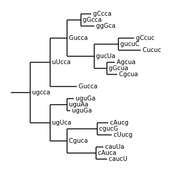
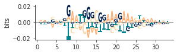
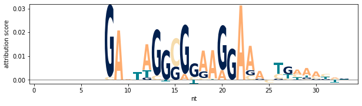
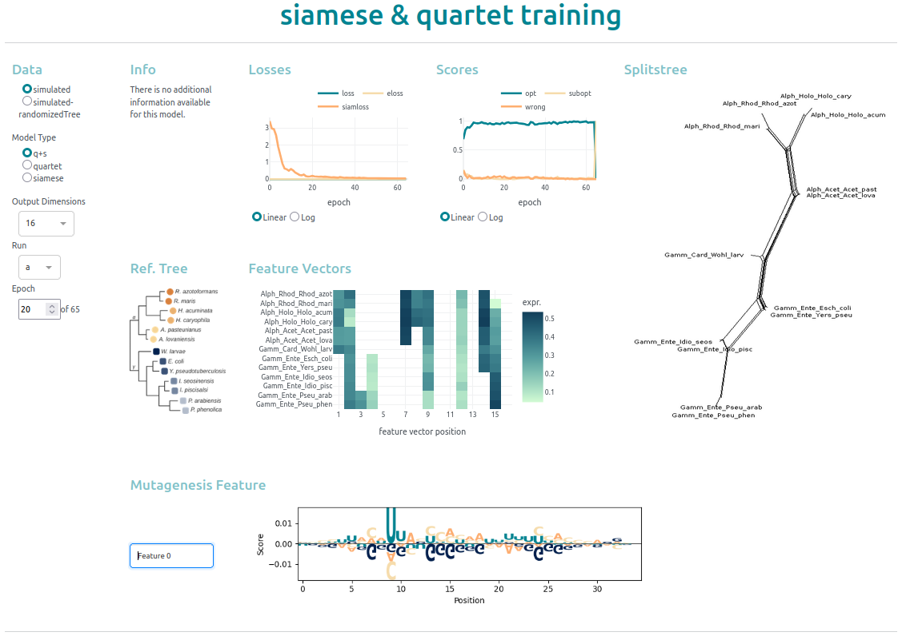

If you are mainly interested in exploring the training results, check out how to use the [[#Explore the results with Dashboard|Dashboard]]. 
If you want to use the training code start with the [[#Install|Installation instructions]]


- [Install](#Install)
 
- [Training a siamese or quartet model](#Training a siamese or quartet model)
	- [Prepare quartets and distances](#Training a siamese or quartet model#Prepare quartets and distances)
	- [[#Training a siamese or quartet model#Setting up data and model|Setting up data and model]]
	- [[#Training a siamese or quartet model#Training and evaluating the model|Training and evaluating the model]]
- [[#Tracking metadata and results|Tracking metadata and results]]
	- [[#Tracking metadata and results#Write results during training|Write results during training]]
	- [[#Tracking metadata and results#Write metadata|Write metadata]]
- [[#Data simulation|Data simulation]]
		- [[#Write metadata#Generating sequences|Generating sequences]]
		- [[#Write metadata#Inspecting sequences|Inspecting sequences]]
		- [[#Write metadata#Writing generated sequences|Writing generated sequences]]
- [[#Attribution scores from in silico mutagenesis|Attribution scores from in silico mutagenesis]]
- [[#Attribution scores from DeepLIFT|Attribution scores from DeepLIFT]]
- [[#Explore the results with Dashboard|Explore the results with Dashboard]]


# Install


The recomended way is to create a new [conda environment](https://docs.conda.io/projects/conda/en/latest/user-guide/install/index.html) with the provided `qnet.yaml` file, as it comes with specific package versions for tensorflow and others:
```
cd ./qtools 
conda env create -f qnet.yml
conda activate qnet
```


If you need to troubleshoot or you prefer to install required packages in a different way, you can  install the qtools independent from `qnet.yml`: 
```
cd ./qtools
python setup.py sdist
pip install .
```

### Requirements
A list of requirements is provided in `/qtools/requirements.txt.` A common pitfall is the incompatibility of numpy and tensorflow versions, so be careful to **make sure that your numpy version fits your tensorflow version**. I used the following combination: 

- python==3.9.7
- tensorflow==2.4.1
- numpy==1.21.2


# Training a siamese or quartet model 


## Prepare quartets and distances 

You need several files for quartet learning, siamese leanring and the combined quartet-siames learning . 
Start by creating a Bio.Phylo.Newick.Tree object with your training species
```python 

from Bio import Phylo 
import  qtools.data_prepper as dp

# get the reference tree
ref_tree = Phylo.read(ref_tree_file, "newick")

# prepare names of species used for testing
train_name = ['spec1', 'spec2', 'spec3', 'spec4', 'spec5', 'spec6]

# prune the reference tree to names from testing and write to file 
tree = dp.prune_tree(ref_tree, train_names)

```

Prepare the list of minibatches for the quartet training and siamese training. For the siamese training and siamese regulation, you also need a pairwise distance matrix with the edge length between all pairs of taxa. All prepared data are pandas.DataFrames

```python 
import itertools 

# calculate minibatches for quartet training
minibatches = dp.get_quartets_from_tree(tree)

# calculate minibatches for siamese training 
siamesebatches = itertools.combinations(train_names, 2)
siamesebatches = pd.DataFrame(siamesebatches)

# calculate edge distances and write to file 
distances = dp.get_edgelengths(tree, train_names)
```


## Setting up data and model 
The code in this chapter along with some comments can be found in the `training_detailed.py` script. 


Importing some modules 
```python
import pandas as pd
import numpy as np
from scipy.spatial import distance_matrix
import qtools as qt
from tensorflow.keras.optimizers import Nadam```

You  need to set up some training variables before the training. 
```python
batch_size = 1
epochs = 100
```

Several options depend on whether you want to use a simple siamese network or a quartet network with or without siamese regulation. 
If you want to use the quartet network, you can regulate the grade of siamese regulation via sigma. Sigma is the relation between quartet loss and siamese correction as $loss = quartet loss + (siamese loss * sigma)$.

```python
from qtools.quartettroutines import siamesemodel, quartetmodel
from qtools.lossfunctions import  siamloss_siamnet, Xsq_SiamReg, siamloss, eloss

# if running as siamese model 
if mode == 'siamese':
    Multimodel = siamesemodel
    minibatch_file = minibatches_file_siamese
    sigma = 'nan'
    loss_function = siamloss_siamnet
    metrics = None

# if running as quartet model, with or without siamese regulation
if mode == 'quartet':
    Multimodel = quartetmodel
    minibatch_file = minibatches_file_quartet 
    sigma = 0.1 
    loss_function = Xsq_SiamReg(sigma)
    metrics = [eloss, siamloss] 
```

You need to prepare the training sequences and the minibatches. The quartet minibatches are not only used to train the quartet net, but also to calculate the quartet scores. Thus, the quartet minibatches are also needed if the siamese network is supposed to be evaluated with quartet scores. 

```python
# set up training data
data = pd.read_csv(seqs_file)
data = qt.qdata(data)

#  read minibatches 
minibatches = pd.read_csv(minibatch_file, index_col=0)
edge_distance = pd.read_csv(edge_distance_file, index_col=0)
scoring_batches = pd.read_csv(minibatches_quartet_file, index_col=0)
```

You are now ready to set up your model 
```python 
# set up model 
seq_len = data.get_seqlen()
singlemodel = qt.CNN_ONEHOT(seq_len)

# build quartetnet or siamesenet
multimodel = Multimodel.from_basemodel(singlemodel.model)
multimodel.compile(optimizer=Nadam(learning_rate=0.001), loss=loss_function, metrics=metrics)
```

I used `singlemodel` to keep track of the encoding function and some other stuff, but it should be easy to initialize the `Multimodel` with every other (Sequential) tensorflow model. If you did that, you might also want to replace the encoding function provided to data.encode in the next step. 

Next thing we need are the encoded training data
```python
# encode the training data and split them in encoded data and species names
data.encode(singlemodel.encoding_function)
x_encoded, x_species = data.get_data()
```

## Training and evaluating the model 
Training the model is quite easy. You can use a for-loop for it. I use several evaluation steps after each epoch. 
```Python 
for e in range(epochs):
	# prepare training batches
    batches = data.batchmaker(minibatches, batch_size, edge_distance) 
           
    # train quartetnet (or siamesenet)
    multimodel.fit(batches, batch_size = batch_size)         

    # evaluate epoche
    losses = multimodel.history.history
    
    # calculate matrix with euclidean distances
    prediction = multimodel.predict(x_encoded)
    matrix_i = multimodel.get_distance_matrix(prediction)
    
    # calculate quartet scores (check how many quartets are in right split)
    scores = qt.get_qscores(matrix_i, x_species, scoring_batches)
    
    # make splitstree diagram from distance matrix
    qt.matrix2nexus(matrix=matrix_i, taxa=x_species, nexusfile='filename.nex', plot_now=True)   
```
If you want to use the parameter `epochs` of multimodel.fit instead of the for-loop, you will have to provide the corect `steps_per_epoch`-parameter with it. Also make sure to pass the same `epoch`-parameter to data.batchmaker, too. 


# Tracking metadata and results


I have used a dashboard for visualization of the results. The files that contain the data that are plotted on the dashboard are produced during training. The `tracking` module  automatically writes feature vectors, scores and losses to json-files. If you are interested in that also have a look at  the `training.py` script.  


## Write results during training  

The tracking module makes it easuier to keep track of loss, quartet scores and feature vectors during training.  You have to initialize it before the first epoch
```python 

# initialize the tracking before the first epoch 
t = Tracking(out_dir, y_names=x_species)
```
Write out the species names once, because they will not be tracked with the feature vectors. This is so you do not mix up the positions of the species later on. 
```python
t.write_species_names()
```
Now you can write out feature vectors, losses and quartet scores after each epoch 
```python 
for e in epochs: 
	t.trackall(epoch=e, feature_vectors=prediction, score=scores, loss=losses)
	t.writeall()
```
If you need more details, have a look at the `training.py` script. 


## Write metadata 

Independent from the other tracking, you can track the metadata during training, These can be used for data selection in the Dashboard. 
```python
# Write the metadata from all local varaibles to  meta.json  in the output directory. 
from qtools.data_tracking import metadata
metadata.record(locals()).write()
```
This function assumes you have several local variables defined.

epochs : int 
	tensorflow variable
learning_rate : float
	tensorflow variable
batch_size : int
	tensorflow variable
sigma : float 
	used for quartet+siamese loss 
seq_len : int 
	length of the input sequences
seqs_file : str 
	file with input data
out_dir : str 
	directory your output is written to 
mutation_scheme : str 
	indicator on which simulated seqeuence was used for training     


# Data simulation 

This code can be used to simulate data along a given tree.  Code on how to use the data simulation can be found in the script `simulate_data_on_given_tree.py`. 

There are three types of sequences that can be created: 
1. evolving: a sequence is randomly generated at the 'root' and randomly mutated at each node 
2. random: the sequence is randomly created for each taxon 
3. stable: the same sequence is used for each taxon 

All three sequence types can be freely combined. 


The tree object is a patched Phylo.Newick.Tree object from biopython , where i added functions to simulate the sequences along the tree. The tree object is created like this: 

```python 
from Bio import Phylo
from qtools.simulate_data import patch_tree

tree = Phylo.read(tree, "newick")
tree = patch_tree(tree)
```

### Generating sequences

Once you patched the tree, you can use the functions for simulating sequences: 

```python 
length_seq = 5 
mutations_per_node = 1

tree.simulate_evolving('seqID_1', length_seq, mutations_per_node)
tree.simulate_stable('seqID_2', length_seq)
tree.simulate_random('seqID_3', length_seq)
```

If you create sequences in a loop, you might want to clear the generated sequences after each run to avoid confusions. 
```python
# delete the dictionaries and mutation scheme to prep for next run 
tree.clear_sequences()
```

### Inspecting sequences 


While the sequences are generated, a mutation scheme is written to tree.mutationscheme, with  *n* : nts in evolving sequence, *m* : mutations, *s* : stable nts, *r* : random nts. 
```python 
# inspect the mutation scheme for the tree. 
tree.mutationscheme
>>> {'seqID_1': 'n5m1', 'seqID_2': 's5', 'seqID_3': 'r5'}
tree.mutationscheme.as_str()
>>> 'n5m1_s5_r5'
```

The sequences itself are written to a seqs_dict at each clade. An additional dictionary control_dict is used in which the nt mutated at this node are written in large letters, nts not mutated at this node are in small letters.

```python
# inspect the generated sequences at an internal node
internal_node = tree.get_nonterminals()[-1]
internal_node.seqs_dict
>>> {'seq1': 'CAUCA', 'seq2': 'UGUUU', 'seq3': 'UUCUG'}
internal_node.control_dict
>>> {'seqID_1': 'cAuca', 'seqID_2': 'sssss', 'seqID_3': 'rrrrr'}
```


### Writing generated sequences 

There are two ways to write the generated sequences. `tree.write_as_tree` writes trees from all sequences and control sequences to newick format and additionally plots these trees to a given path. `tree.write_as_csv` writes a  `sequences.csv` file with all sequences and control sequences to a given path. 
```python
# write results to path
tree.write_as_tree(path)
tree.write_as_csv(path)
```




# Attribution scores from in silico mutagenesis


To calculate attribution scores with in silico mutagenesis, you need to select a model and  a feature to calculate the scores for. You can select your feature  of interest from the Dashboard.


```python
from qtools.attribution_scores import calculate_mutagensis_scores, mutagenesis

 # make all mutagenesis for the sequence from a one-hot encoded sequence
mutated_seqs = mutagenesis(x_encoded)

# forward pass for all mutated sequences
predictions = coremodel.predict(np.array(mutated_seqs))

# calculate attribution scores
# you need to give the length of the input sequence and the number of output nodes, as well as the index of the node (feature) that you want to calculate the scores for
attributions = calculate_mutagensis_scores(predictions, input_length = 35, output_nodes = 30, feature =2)
```

You can visualize the scores with logomaker
```python
from qnet import motif

mymotif = pd.DataFrame(attributions, columns= ['C', 'G', 'T', 'A'])
motif.make_logo(mymotif)
```




If you want more details on how to calculate the in silico mutagenesis, look at the script `in_silico_mutagenesis.py`


# Attribution scores from DeepLIFT


I have used DeepLIFT  for this work. Please find details on how to install and use DeepLift in the  [DeepLIFT repository](https://github.com/kundajelab/deeplift)

DeepLIFT is based on tensorflow 1, so that you will need a new environment to use it. This is how I build my environment: 

```
cd qdeeplift 
conda env create -f qdeep.yml 
conda activate qdeep
```

Have a look at `scores_from_deeplift.py` to get more details about how to create attribution scores from quartet and siamese networks with DeepLIFT.





# Explore the results with Dashboard

If you want to explore the input sequences and the results of trained models, you can check out the dashboard in the dashboard folder. The dashboard has mainly been created with [dash from plotly](https://dash.plotly.com/)

You might want to set up a new environment for the dashboard with [conda](https://docs.conda.io/projects/conda/en/latest/user-guide/index.html) and start the dashboard with pyhton
```
cd ./qdashboard 

conda env create -f qdash.yml
conda activate qdash

python dashboard.py
```
You can use the dashboard to 
- see **losses and quartet scores** for different model types and different initializations/trainings of the models 
- check out **feature vectors and splits diagrams** for each epoch during training (splits diagrams created with [SplitsTree4](https://software-ab.cs.uni-tuebingen.de/download/splitstree4/manual.pdf))
- build **alignment motifs** from the training data (with the help of [logomaker](https://logomaker.readthedocs.io/en/latest/))
- (hopefully) comming soon: create **in silico mutagenesis** and attribution scores for different models / output features




